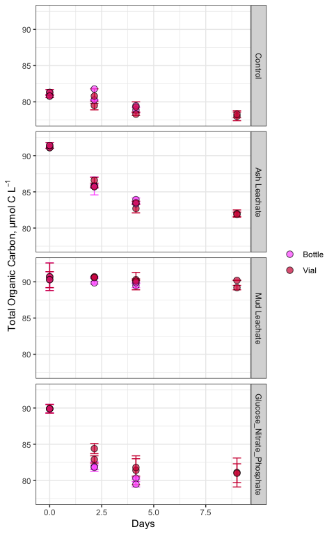
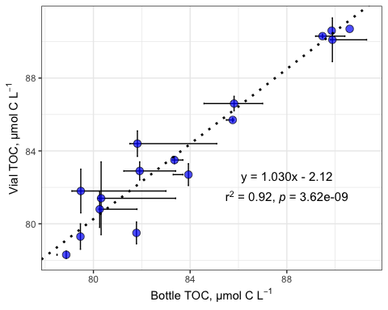
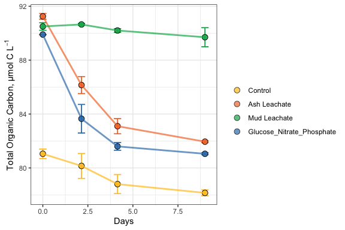
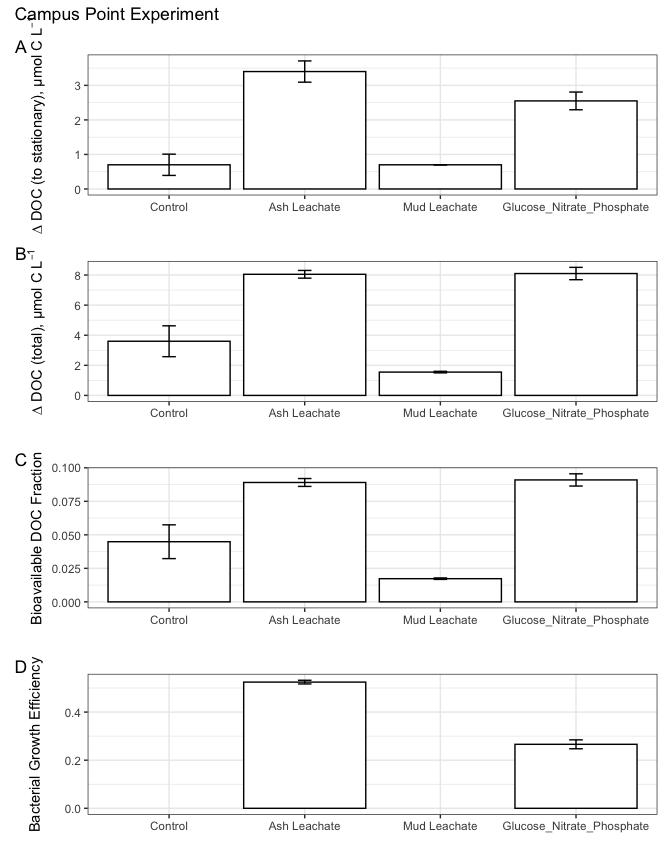

144L\_2018\_TOC
================
Christina Jimenez
11/9/2020

# Load libraries

``` r
library(tidyverse)
library(readxl)
library(lubridate)
library(lmodel2)
library(zoo)
library(patchwork)
```

# Import Data

``` r
excel_sheets("~/Desktop/GITHUB/144l_students/Input_Data/week4/144L_2018_Exp_TOC.xlsx")
```

    ## [1] "Metadata" "Data"

``` r
metadata <- read_excel("~/Desktop/GITHUB/144l_students/Input_Data/week4/144L_2018_Exp_TOC.xlsx", sheet = "Metadata")
data <- read_excel("~/Desktop/GITHUB/144l_students/Input_Data/week4/144L_2018_Exp_TOC.xlsx", sheet = "Data")
```

``` r
glimpse(metadata)
```

    ## Rows: 80
    ## Columns: 16
    ## $ Experiment           <chr> "144L_2018", "144L_2018", "144L_2018", "144L_201…
    ## $ Location             <chr> "Campus Point", "Campus Point", "Campus Point", …
    ## $ Temperature          <dbl> 20, 20, 20, 20, 20, 20, 20, 20, 20, 20, 20, 20, …
    ## $ Depth                <dbl> 1, 1, 1, 1, 1, 1, 1, 1, 1, 1, 1, 1, 1, 1, 1, 1, …
    ## $ Bottle               <chr> "A", "A", "A", "A", "A", "A", "A", "A", "A", "A"…
    ## $ Timepoint            <dbl> 0, 1, 2, 3, 4, 5, 6, 7, 8, 9, 0, 1, 2, 3, 4, 5, …
    ## $ Treatment            <chr> "Control", "Control", "Control", "Control", "Con…
    ## $ Target_DOC_Amendment <dbl> 0, 0, 0, 0, 0, 0, 0, 0, 0, 0, 0, 0, 0, 0, 0, 0, …
    ## $ Inoculum_L           <dbl> 1.5, 1.5, 1.5, 1.5, 1.5, 1.5, 1.5, 1.5, 1.5, 1.5…
    ## $ Media_L              <dbl> 3.5, 3.5, 3.5, 3.5, 3.5, 3.5, 3.5, 3.5, 3.5, 3.5…
    ## $ Datetime             <chr> "2018-10-15T16:30", "2018-10-16T08:00", "2018-10…
    ## $ TOC_Sample           <lgl> TRUE, FALSE, FALSE, FALSE, TRUE, FALSE, FALSE, F…
    ## $ Parallel_Sample      <lgl> TRUE, FALSE, FALSE, FALSE, TRUE, FALSE, FALSE, F…
    ## $ Cell_Sample          <lgl> TRUE, TRUE, TRUE, TRUE, TRUE, TRUE, TRUE, TRUE, …
    ## $ DNA_Sample           <lgl> TRUE, FALSE, FALSE, FALSE, TRUE, FALSE, FALSE, F…
    ## $ DNA_SampleID         <chr> "144_A0_S6", NA, NA, NA, "144_A4_S7", NA, NA, NA…

``` r
glimpse(data)
```

    ## Rows: 32
    ## Columns: 6
    ## $ Bottle    <chr> "A", "A", "A", "A", "B", "B", "B", "B", "C", "C", "C", "C",…
    ## $ Timepoint <dbl> 0, 4, 8, 9, 0, 4, 8, 9, 0, 4, 8, 9, 0, 4, 8, 9, 0, 4, 8, 9,…
    ## $ TOC       <dbl> 81.30000, 81.77997, 78.87473, NA, 80.80000, 80.25890, 79.46…
    ## $ TOC_sd    <dbl> 0.40000000, NA, 0.38725049, NA, 0.20000000, 0.03069669, NA,…
    ## $ PTOC      <dbl> 81.3, 79.5, 78.3, 78.0, 80.8, 80.8, 79.3, 78.3, 91.1, 86.6,…
    ## $ PTOC_sd   <dbl> 0.4, 0.6, 0.2, 0.6, 0.2, 1.0, 0.7, 0.5, NA, 0.4, 0.6, 0.5, …

# Prepare data

``` r
joined <- left_join(metadata, data)
```

    ## Joining, by = c("Bottle", "Timepoint")

``` r
toc <- joined %>% 
  mutate(Datetime = ymd_hm(Datetime)) %>% 
  group_by(Experiment, Bottle) %>% 
  mutate(interv = interval(first(Datetime), Datetime),
         hours = interv/3600, 
         days = hours/24) %>% 
  ungroup() %>% 
  rename(sd_TOC = TOC_sd,
         sd_PTOC = PTOC_sd) %>%
  select(Experiment:Datetime, hours, days, everything(), -c(contains("Sample"), interv))
```

``` r
glimpse(toc)
```

    ## Rows: 80
    ## Columns: 17
    ## $ Experiment           <chr> "144L_2018", "144L_2018", "144L_2018", "144L_201…
    ## $ Location             <chr> "Campus Point", "Campus Point", "Campus Point", …
    ## $ Temperature          <dbl> 20, 20, 20, 20, 20, 20, 20, 20, 20, 20, 20, 20, …
    ## $ Depth                <dbl> 1, 1, 1, 1, 1, 1, 1, 1, 1, 1, 1, 1, 1, 1, 1, 1, …
    ## $ Bottle               <chr> "A", "A", "A", "A", "A", "A", "A", "A", "A", "A"…
    ## $ Timepoint            <dbl> 0, 1, 2, 3, 4, 5, 6, 7, 8, 9, 0, 1, 2, 3, 4, 5, …
    ## $ Treatment            <chr> "Control", "Control", "Control", "Control", "Con…
    ## $ Target_DOC_Amendment <dbl> 0, 0, 0, 0, 0, 0, 0, 0, 0, 0, 0, 0, 0, 0, 0, 0, …
    ## $ Inoculum_L           <dbl> 1.5, 1.5, 1.5, 1.5, 1.5, 1.5, 1.5, 1.5, 1.5, 1.5…
    ## $ Media_L              <dbl> 3.5, 3.5, 3.5, 3.5, 3.5, 3.5, 3.5, 3.5, 3.5, 3.5…
    ## $ Datetime             <dttm> 2018-10-15 16:30:00, 2018-10-16 08:00:00, 2018-…
    ## $ hours                <Interval> 2018-10-15 16:30:00 UTC--2018-10-15 16:30:0…
    ## $ days                 <Interval> 2018-10-15 16:30:00 UTC--2018-10-15 16:30:0…
    ## $ TOC                  <dbl> 81.30000, NA, NA, NA, 81.77997, NA, NA, NA, 78.8…
    ## $ sd_TOC               <dbl> 0.40000000, NA, NA, NA, NA, NA, NA, NA, 0.387250…
    ## $ PTOC                 <dbl> 81.3, NA, NA, NA, 79.5, NA, NA, NA, 78.3, 78.0, …
    ## $ sd_PTOC              <dbl> 0.4, NA, NA, NA, 0.6, NA, NA, NA, 0.2, 0.6, 0.2,…

# Plot the curves

## Pivot data

``` r
pivot_toc <- toc %>% 
  select(Experiment, Location, Bottle, Treatment, days, TOC, PTOC) %>% 
  pivot_longer(TOC:PTOC, names_to = "sample", values_to = "value")

pivot_toc_sd <- toc %>% 
  select(Experiment, Location, Bottle, Treatment, days, sd_TOC, sd_PTOC) %>%
  pivot_longer(sd_TOC:sd_PTOC, names_to = "sample", names_prefix = "sd_", values_to = "sd") 

pivoted <- left_join(pivot_toc, pivot_toc_sd) %>% 
  mutate(sample = ifelse(sample == "TOC", "Bottle", "Vial"))
```

    ## Joining, by = c("Experiment", "Location", "Bottle", "Treatment", "days", "sample")

``` r
glimpse(pivoted)
```

    ## Rows: 160
    ## Columns: 8
    ## $ Experiment <chr> "144L_2018", "144L_2018", "144L_2018", "144L_2018", "144L_…
    ## $ Location   <chr> "Campus Point", "Campus Point", "Campus Point", "Campus Po…
    ## $ Bottle     <chr> "A", "A", "A", "A", "A", "A", "A", "A", "A", "A", "A", "A"…
    ## $ Treatment  <chr> "Control", "Control", "Control", "Control", "Control", "Co…
    ## $ days       <Interval> 2018-10-15 16:30:00 UTC--2018-10-15 16:30:00 UTC, 201…
    ## $ sample     <chr> "Bottle", "Vial", "Bottle", "Vial", "Bottle", "Vial", "Bot…
    ## $ value      <dbl> 81.30000, 81.30000, NA, NA, NA, NA, NA, NA, 81.77997, 79.5…
    ## $ sd         <dbl> 0.4000000, 0.4000000, NA, NA, NA, NA, NA, NA, NA, 0.600000…

## Plot

``` r
custom.colors <- c("Control" = "#ffc425", "Ash Leachate" = "#f37735", "Glucose_Nitrate_Phosphate" = "#377EB8", "Mud Leachate" = "#00b159", "Campus Point" = "#00aedb", "Vial" = "#d11141", "Bottle" = "#FF66FF")
levels <- c("Control", "Ash Leachate", "Mud Leachate", "Glucose_Nitrate_Phosphate", "Campus Point", "Bottle", "Vial")

pivoted %>% 
  drop_na(value) %>% 
  mutate(Treatment = factor(Treatment, levels = levels),
         sample = factor(sample, levels = levels)) %>% 
  ggplot(aes(x = days, y = value, group = interaction(Treatment, Bottle))) +
  geom_errorbar(aes(ymin = value - sd, ymax = value + sd, color = sample), width = 0.4) +
  geom_point(aes(fill = sample), size = 3, shape = 21, alpha = 0.7) +
  scale_color_manual(values = custom.colors) +
  scale_fill_manual(values = custom.colors) +
  labs(x = "Days", y = expression("Total Organic Carbon, µmol C L"^-1), color = "", fill = "") +
  theme_bw() +
  facet_grid(rows = "Treatment") +
  guides(color = F)
```

<!-- -->

# TOC v PTOC (bottle v vial samples)

``` r
# install.packages("lmodel2")

reg.data <- toc %>%
  drop_na(TOC) %>% 
  filter(Timepoint > 0)

reg <- lmodel2(PTOC ~ TOC, data = reg.data, nperm = 99)
```

    ## RMA was not requested: it will not be computed.

``` r
intercept <- reg$regression.results[3, 2]
slope <- reg$regression.results[3, 3]
two_int <- reg$confidence.intervals[3, 2] 
two_slope <- reg$confidence.intervals[3, 4]
nine_int <- reg$confidence.intervals[3, 3]
nine_slope <- reg$confidence.intervals[3, 5]
```

``` r
reg.data %>% 
  ggplot(aes(x = TOC, y = PTOC)) +
  geom_errorbar(aes(ymin = PTOC - sd_PTOC, ymax = PTOC + sd_PTOC), width = 0.05) +
  geom_errorbarh(aes(xmin = TOC - sd_TOC, xmax = PTOC + sd_PTOC), width = 0.05) +
  geom_point(fill = "blue", shape = 21, size = 3, alpha = 0.7) +
  geom_abline(intercept = intercept, slope = slope, linetype = 3, size = 1) +
  geom_abline(intercept = two_int, slope = two_slope, color = "black", linetype = 3, size = 1) +
  geom_abline(intercept = nine_int, slope = nine_slope, color = "black", linetype = 3, size = 1) +
  labs(x = expression("Bottle TOC, µmol C L"^-1), y = expression("Vial TOC, µmol C L"^-1)) +
  theme_bw() +
  annotate( geom = "text", label = expression(atop("y = 1.030x - 2.12", paste("r"^2," = 0.92, ", italic("p "), "= 3.62e-09"))), x = 88, y = 82, size = 4) 
```

    ## Warning: Ignoring unknown parameters: width

    ## Warning: Removed 4 rows containing missing values (geom_errorbarh).

    ## Warning in is.na(x): is.na() applied to non-(list or vector) of type
    ## 'expression'

<!-- -->

``` r
bc <- read_rds("~/Desktop/GITHUB/144l_students/Output_Data/week3/BactAbundanceData.rds")

merge <- left_join(toc, bc) %>% 
  select(Experiment:days, TOC:sd_PTOC, cells:diff_ln_cells, bc, ave_bc, sd_bc, everything(), -c(contains("Sample")) ) %>% 
  group_by(Experiment, Treatment, Bottle) %>% 
  fill(exp_start:sd_delta_bc) %>% 
  ungroup()
```

    ## Joining, by = c("Experiment", "Location", "Temperature", "Depth", "Bottle", "Timepoint", "Treatment", "Target_DOC_Amendment", "Inoculum_L", "Media_L", "Datetime", "hours", "days")

``` r
glimpse(merge)
```

    ## Rows: 80
    ## Columns: 43
    ## $ Experiment           <chr> "144L_2018", "144L_2018", "144L_2018", "144L_201…
    ## $ Location             <chr> "Campus Point", "Campus Point", "Campus Point", …
    ## $ Temperature          <dbl> 20, 20, 20, 20, 20, 20, 20, 20, 20, 20, 20, 20, …
    ## $ Depth                <dbl> 1, 1, 1, 1, 1, 1, 1, 1, 1, 1, 1, 1, 1, 1, 1, 1, …
    ## $ Bottle               <chr> "A", "A", "A", "A", "A", "A", "A", "A", "A", "A"…
    ## $ Timepoint            <dbl> 0, 1, 2, 3, 4, 5, 6, 7, 8, 9, 0, 1, 2, 3, 4, 5, …
    ## $ Treatment            <chr> "Control", "Control", "Control", "Control", "Con…
    ## $ Target_DOC_Amendment <dbl> 0, 0, 0, 0, 0, 0, 0, 0, 0, 0, 0, 0, 0, 0, 0, 0, …
    ## $ Inoculum_L           <dbl> 1.5, 1.5, 1.5, 1.5, 1.5, 1.5, 1.5, 1.5, 1.5, 1.5…
    ## $ Media_L              <dbl> 3.5, 3.5, 3.5, 3.5, 3.5, 3.5, 3.5, 3.5, 3.5, 3.5…
    ## $ Datetime             <dttm> 2018-10-15 16:30:00, 2018-10-16 08:00:00, 2018-…
    ## $ hours                <Interval> 2018-10-15 16:30:00 UTC--2018-10-15 16:30:0…
    ## $ days                 <Interval> 2018-10-15 16:30:00 UTC--2018-10-15 16:30:0…
    ## $ TOC                  <dbl> 81.30000, NA, NA, NA, 81.77997, NA, NA, NA, 78.8…
    ## $ sd_TOC               <dbl> 0.40000000, NA, NA, NA, NA, NA, NA, NA, 0.387250…
    ## $ PTOC                 <dbl> 81.3, NA, NA, NA, 79.5, NA, NA, NA, 78.3, 78.0, …
    ## $ sd_PTOC              <dbl> 0.4, NA, NA, NA, 0.6, NA, NA, NA, 0.2, 0.6, 0.2,…
    ## $ cells                <dbl> 332531522, 523943125, 859019934, 906998856, 9330…
    ## $ ln_cells             <dbl> 19.62225, 20.07689, 20.57130, 20.62565, 20.65394…
    ## $ diff_ln_cells        <dbl> 0.000000000, 0.454648479, 0.494408990, 0.0543490…
    ## $ bc                   <dbl> 0.8313288, 1.3098578, 2.1475498, 2.2674971, 2.33…
    ## $ ave_bc               <dbl> 0.9022187, 1.3301541, 1.9535757, 2.3515191, 2.54…
    ## $ sd_bc                <dbl> 0.10025342, 0.02870334, 0.27432087, 0.11882499, …
    ## $ exp_start            <dbl> 0, 0, 0, 0, 0, 0, 0, 0, 0, 0, 0, 0, 0, 0, 0, 0, …
    ## $ exp_end              <dbl> 1, 1, 1, 1, 1, 1, 1, 1, 1, 1, 1, 1, 1, 1, 1, 1, …
    ## $ ln_cells_exp_start   <dbl> 19.62225, 19.62225, 19.62225, 19.62225, 19.62225…
    ## $ ln_cells_exp_end     <dbl> 20.07689, 20.07689, 20.07689, 20.07689, 20.07689…
    ## $ cells_exp_start      <dbl> 332531522, 332531522, 332531522, 332531522, 3325…
    ## $ cells_exp_end        <dbl> 523943125, 523943125, 523943125, 523943125, 5239…
    ## $ days_exp_start       <dbl> 0, 0, 0, 0, 0, 0, 0, 0, 0, 0, 0, 0, 0, 0, 0, 0, …
    ## $ days_exp_end         <dbl> 0.6458333, 0.6458333, 0.6458333, 0.6458333, 0.64…
    ## $ mew                  <dbl> 0.7039718, 0.7039718, 0.7039718, 0.7039718, 0.70…
    ## $ doubling             <dbl> 0.9846235, 0.9846235, 0.9846235, 0.9846235, 0.98…
    ## $ delta_cells          <dbl> 191411603, 191411603, 191411603, 191411603, 1914…
    ## $ delta_bc             <dbl> 0.4785290, 0.4785290, 0.4785290, 0.4785290, 0.47…
    ## $ ave_mew              <dbl> 0.6056875, 0.6056875, 0.6056875, 0.6056875, 0.60…
    ## $ sd_mew               <dbl> 0.10113376, 0.10113376, 0.10113376, 0.10113376, …
    ## $ ave_doubling         <dbl> 1.1753457, 1.1753457, 1.1753457, 1.1753457, 1.17…
    ## $ sd_doubling          <dbl> 0.196251588, 0.196251588, 0.196251588, 0.1962515…
    ## $ ave_delta_cells      <dbl> 171174186, 171174186, 171174186, 171174186, 1711…
    ## $ sd_delta_cells       <dbl> 20824130, 20824130, 20824130, 20824130, 20824130…
    ## $ ave_delta_bc         <dbl> 0.4279355, 0.4279355, 0.4279355, 0.4279355, 0.42…
    ## $ sd_delta_bc          <dbl> 0.05206033, 0.05206033, 0.05206033, 0.05206033, …

``` r
subset <- merge %>% 
  select(Experiment, Treatment, Bottle, days, PTOC, bc)
```

# Interpolate

## Split

``` r
to_interpolate <- merge %>% 
  select(Experiment, Bottle, Timepoint, days, PTOC, bc) %>% 
  group_by(Experiment, Bottle) 

list <- to_interpolate %>% 
  group_split()

keys <- to_interpolate %>% 
  group_keys() %>%
  mutate(key = paste(Experiment, Bottle))

names(list) <- keys$key
```

## Write the function

``` r
interp.func <- function(x) {
  y <- zoo(x, order.by = x$days) 
  interp_toc <- round(as.numeric(na.approx(y$PTOC, na.rm = F)), 1) 
  interp_bc <- round(as.numeric(na.approx(y$bc, na.rm = F)), 1)
  z <- cbind(y, interp_toc, interp_bc) 
  as_tibble(z) 
}
```

## Apply and Combine

``` r
interpolated <- lapply(list, interp.func) %>% 
  plyr::ldply(., as.data.frame) %>% 
  select(-c(.id, PTOC, bc, days)) %>% 
  mutate_at(vars(Timepoint:interp_bc), as.numeric) %>% 
  left_join(merge, .)
```

    ## Joining, by = c("Experiment", "Bottle", "Timepoint")

``` r
glimpse(interpolated)
```

    ## Rows: 80
    ## Columns: 45
    ## $ Experiment           <chr> "144L_2018", "144L_2018", "144L_2018", "144L_201…
    ## $ Location             <chr> "Campus Point", "Campus Point", "Campus Point", …
    ## $ Temperature          <dbl> 20, 20, 20, 20, 20, 20, 20, 20, 20, 20, 20, 20, …
    ## $ Depth                <dbl> 1, 1, 1, 1, 1, 1, 1, 1, 1, 1, 1, 1, 1, 1, 1, 1, …
    ## $ Bottle               <chr> "A", "A", "A", "A", "A", "A", "A", "A", "A", "A"…
    ## $ Timepoint            <dbl> 0, 1, 2, 3, 4, 5, 6, 7, 8, 9, 0, 1, 2, 3, 4, 5, …
    ## $ Treatment            <chr> "Control", "Control", "Control", "Control", "Con…
    ## $ Target_DOC_Amendment <dbl> 0, 0, 0, 0, 0, 0, 0, 0, 0, 0, 0, 0, 0, 0, 0, 0, …
    ## $ Inoculum_L           <dbl> 1.5, 1.5, 1.5, 1.5, 1.5, 1.5, 1.5, 1.5, 1.5, 1.5…
    ## $ Media_L              <dbl> 3.5, 3.5, 3.5, 3.5, 3.5, 3.5, 3.5, 3.5, 3.5, 3.5…
    ## $ Datetime             <dttm> 2018-10-15 16:30:00, 2018-10-16 08:00:00, 2018-…
    ## $ hours                <Interval> 2018-10-15 16:30:00 UTC--2018-10-15 16:30:0…
    ## $ days                 <Interval> 2018-10-15 16:30:00 UTC--2018-10-15 16:30:0…
    ## $ TOC                  <dbl> 81.30000, NA, NA, NA, 81.77997, NA, NA, NA, 78.8…
    ## $ sd_TOC               <dbl> 0.40000000, NA, NA, NA, NA, NA, NA, NA, 0.387250…
    ## $ PTOC                 <dbl> 81.3, NA, NA, NA, 79.5, NA, NA, NA, 78.3, 78.0, …
    ## $ sd_PTOC              <dbl> 0.4, NA, NA, NA, 0.6, NA, NA, NA, 0.2, 0.6, 0.2,…
    ## $ cells                <dbl> 332531522, 523943125, 859019934, 906998856, 9330…
    ## $ ln_cells             <dbl> 19.62225, 20.07689, 20.57130, 20.62565, 20.65394…
    ## $ diff_ln_cells        <dbl> 0.000000000, 0.454648479, 0.494408990, 0.0543490…
    ## $ bc                   <dbl> 0.8313288, 1.3098578, 2.1475498, 2.2674971, 2.33…
    ## $ ave_bc               <dbl> 0.9022187, 1.3301541, 1.9535757, 2.3515191, 2.54…
    ## $ sd_bc                <dbl> 0.10025342, 0.02870334, 0.27432087, 0.11882499, …
    ## $ exp_start            <dbl> 0, 0, 0, 0, 0, 0, 0, 0, 0, 0, 0, 0, 0, 0, 0, 0, …
    ## $ exp_end              <dbl> 1, 1, 1, 1, 1, 1, 1, 1, 1, 1, 1, 1, 1, 1, 1, 1, …
    ## $ ln_cells_exp_start   <dbl> 19.62225, 19.62225, 19.62225, 19.62225, 19.62225…
    ## $ ln_cells_exp_end     <dbl> 20.07689, 20.07689, 20.07689, 20.07689, 20.07689…
    ## $ cells_exp_start      <dbl> 332531522, 332531522, 332531522, 332531522, 3325…
    ## $ cells_exp_end        <dbl> 523943125, 523943125, 523943125, 523943125, 5239…
    ## $ days_exp_start       <dbl> 0, 0, 0, 0, 0, 0, 0, 0, 0, 0, 0, 0, 0, 0, 0, 0, …
    ## $ days_exp_end         <dbl> 0.6458333, 0.6458333, 0.6458333, 0.6458333, 0.64…
    ## $ mew                  <dbl> 0.7039718, 0.7039718, 0.7039718, 0.7039718, 0.70…
    ## $ doubling             <dbl> 0.9846235, 0.9846235, 0.9846235, 0.9846235, 0.98…
    ## $ delta_cells          <dbl> 191411603, 191411603, 191411603, 191411603, 1914…
    ## $ delta_bc             <dbl> 0.4785290, 0.4785290, 0.4785290, 0.4785290, 0.47…
    ## $ ave_mew              <dbl> 0.6056875, 0.6056875, 0.6056875, 0.6056875, 0.60…
    ## $ sd_mew               <dbl> 0.10113376, 0.10113376, 0.10113376, 0.10113376, …
    ## $ ave_doubling         <dbl> 1.1753457, 1.1753457, 1.1753457, 1.1753457, 1.17…
    ## $ sd_doubling          <dbl> 0.196251588, 0.196251588, 0.196251588, 0.1962515…
    ## $ ave_delta_cells      <dbl> 171174186, 171174186, 171174186, 171174186, 1711…
    ## $ sd_delta_cells       <dbl> 20824130, 20824130, 20824130, 20824130, 20824130…
    ## $ ave_delta_bc         <dbl> 0.4279355, 0.4279355, 0.4279355, 0.4279355, 0.42…
    ## $ sd_delta_bc          <dbl> 0.05206033, 0.05206033, 0.05206033, 0.05206033, …
    ## $ interp_toc           <dbl> 81.3, 80.8, 80.3, 79.9, 79.5, 79.2, 78.9, 78.6, …
    ## $ interp_bc            <dbl> 0.8, 1.3, 2.1, 2.3, 2.3, 2.2, 2.0, 2.0, 2.4, NA,…

# Estimate DOC, Bioavailability, BGEs

``` r
doc <- interpolated %>% 
  mutate(doc = interp_toc - interp_bc) %>% 
  group_by(Experiment, Bottle) %>% 
  mutate(bioav_doc = (first(doc) - last(na.omit(doc))) / first(doc), 
         doc_exp_end = ifelse(Timepoint == exp_end, doc, NA),
         delta_doc = first(doc) - doc_exp_end, 
         tdelta_doc = first(doc) - last(na.omit(doc)),
         bge = ifelse(delta_doc > 1.5, delta_bc/delta_doc, NA)) %>% 
  fill(doc_exp_end:bge, .direction = "downup") %>% 
  ungroup()

glimpse(doc)
```

    ## Rows: 80
    ## Columns: 51
    ## $ Experiment           <chr> "144L_2018", "144L_2018", "144L_2018", "144L_201…
    ## $ Location             <chr> "Campus Point", "Campus Point", "Campus Point", …
    ## $ Temperature          <dbl> 20, 20, 20, 20, 20, 20, 20, 20, 20, 20, 20, 20, …
    ## $ Depth                <dbl> 1, 1, 1, 1, 1, 1, 1, 1, 1, 1, 1, 1, 1, 1, 1, 1, …
    ## $ Bottle               <chr> "A", "A", "A", "A", "A", "A", "A", "A", "A", "A"…
    ## $ Timepoint            <dbl> 0, 1, 2, 3, 4, 5, 6, 7, 8, 9, 0, 1, 2, 3, 4, 5, …
    ## $ Treatment            <chr> "Control", "Control", "Control", "Control", "Con…
    ## $ Target_DOC_Amendment <dbl> 0, 0, 0, 0, 0, 0, 0, 0, 0, 0, 0, 0, 0, 0, 0, 0, …
    ## $ Inoculum_L           <dbl> 1.5, 1.5, 1.5, 1.5, 1.5, 1.5, 1.5, 1.5, 1.5, 1.5…
    ## $ Media_L              <dbl> 3.5, 3.5, 3.5, 3.5, 3.5, 3.5, 3.5, 3.5, 3.5, 3.5…
    ## $ Datetime             <dttm> 2018-10-15 16:30:00, 2018-10-16 08:00:00, 2018-…
    ## $ hours                <Interval> 2018-10-15 16:30:00 UTC--2018-10-15 16:30:0…
    ## $ days                 <Interval> 2018-10-15 16:30:00 UTC--2018-10-15 16:30:0…
    ## $ TOC                  <dbl> 81.30000, NA, NA, NA, 81.77997, NA, NA, NA, 78.8…
    ## $ sd_TOC               <dbl> 0.40000000, NA, NA, NA, NA, NA, NA, NA, 0.387250…
    ## $ PTOC                 <dbl> 81.3, NA, NA, NA, 79.5, NA, NA, NA, 78.3, 78.0, …
    ## $ sd_PTOC              <dbl> 0.4, NA, NA, NA, 0.6, NA, NA, NA, 0.2, 0.6, 0.2,…
    ## $ cells                <dbl> 332531522, 523943125, 859019934, 906998856, 9330…
    ## $ ln_cells             <dbl> 19.62225, 20.07689, 20.57130, 20.62565, 20.65394…
    ## $ diff_ln_cells        <dbl> 0.000000000, 0.454648479, 0.494408990, 0.0543490…
    ## $ bc                   <dbl> 0.8313288, 1.3098578, 2.1475498, 2.2674971, 2.33…
    ## $ ave_bc               <dbl> 0.9022187, 1.3301541, 1.9535757, 2.3515191, 2.54…
    ## $ sd_bc                <dbl> 0.10025342, 0.02870334, 0.27432087, 0.11882499, …
    ## $ exp_start            <dbl> 0, 0, 0, 0, 0, 0, 0, 0, 0, 0, 0, 0, 0, 0, 0, 0, …
    ## $ exp_end              <dbl> 1, 1, 1, 1, 1, 1, 1, 1, 1, 1, 1, 1, 1, 1, 1, 1, …
    ## $ ln_cells_exp_start   <dbl> 19.62225, 19.62225, 19.62225, 19.62225, 19.62225…
    ## $ ln_cells_exp_end     <dbl> 20.07689, 20.07689, 20.07689, 20.07689, 20.07689…
    ## $ cells_exp_start      <dbl> 332531522, 332531522, 332531522, 332531522, 3325…
    ## $ cells_exp_end        <dbl> 523943125, 523943125, 523943125, 523943125, 5239…
    ## $ days_exp_start       <dbl> 0, 0, 0, 0, 0, 0, 0, 0, 0, 0, 0, 0, 0, 0, 0, 0, …
    ## $ days_exp_end         <dbl> 0.6458333, 0.6458333, 0.6458333, 0.6458333, 0.64…
    ## $ mew                  <dbl> 0.7039718, 0.7039718, 0.7039718, 0.7039718, 0.70…
    ## $ doubling             <dbl> 0.9846235, 0.9846235, 0.9846235, 0.9846235, 0.98…
    ## $ delta_cells          <dbl> 191411603, 191411603, 191411603, 191411603, 1914…
    ## $ delta_bc             <dbl> 0.4785290, 0.4785290, 0.4785290, 0.4785290, 0.47…
    ## $ ave_mew              <dbl> 0.6056875, 0.6056875, 0.6056875, 0.6056875, 0.60…
    ## $ sd_mew               <dbl> 0.10113376, 0.10113376, 0.10113376, 0.10113376, …
    ## $ ave_doubling         <dbl> 1.1753457, 1.1753457, 1.1753457, 1.1753457, 1.17…
    ## $ sd_doubling          <dbl> 0.196251588, 0.196251588, 0.196251588, 0.1962515…
    ## $ ave_delta_cells      <dbl> 171174186, 171174186, 171174186, 171174186, 1711…
    ## $ sd_delta_cells       <dbl> 20824130, 20824130, 20824130, 20824130, 20824130…
    ## $ ave_delta_bc         <dbl> 0.4279355, 0.4279355, 0.4279355, 0.4279355, 0.42…
    ## $ sd_delta_bc          <dbl> 0.05206033, 0.05206033, 0.05206033, 0.05206033, …
    ## $ interp_toc           <dbl> 81.3, 80.8, 80.3, 79.9, 79.5, 79.2, 78.9, 78.6, …
    ## $ interp_bc            <dbl> 0.8, 1.3, 2.1, 2.3, 2.3, 2.2, 2.0, 2.0, 2.4, NA,…
    ## $ doc                  <dbl> 80.5, 79.5, 78.2, 77.6, 77.2, 77.0, 76.9, 76.6, …
    ## $ bioav_doc            <dbl> 0.05714286, 0.05714286, 0.05714286, 0.05714286, …
    ## $ doc_exp_end          <dbl> 79.5, 79.5, 79.5, 79.5, 79.5, 79.5, 79.5, 79.5, …
    ## $ delta_doc            <dbl> 1.0, 1.0, 1.0, 1.0, 1.0, 1.0, 1.0, 1.0, 1.0, 1.0…
    ## $ tdelta_doc           <dbl> 4.6, 4.6, 4.6, 4.6, 4.6, 4.6, 4.6, 4.6, 4.6, 4.6…
    ## $ bge                  <dbl> NA, NA, NA, NA, NA, NA, NA, NA, NA, NA, NA, NA, …

# Treatment averages

``` r
averages <- doc %>% 
  group_by(Experiment, Treatment, Timepoint) %>% 
  mutate(ave_toc = mean(PTOC),
         sd_toc = sd(PTOC)) %>% 
  ungroup() %>% 
  group_by(Experiment, Treatment) %>% 
  mutate(ave_bioav_doc = mean(bioav_doc),
         sd_bioav_doc = sd(bioav_doc),
         ave_delta_doc = mean(delta_doc),
         sd_delta_doc = sd(delta_doc),
         ave_tdelta_doc = mean(tdelta_doc),
         sd_tdelta_doc = sd(tdelta_doc),
         ave_bge = mean(bge),
         sd_bge = sd(bge)) %>% 
  ungroup()
```

``` r
subset <- averages %>% 
  filter(Experiment == "144L_2018") %>% 
  select(Experiment, Treatment, Bottle, Timepoint, PTOC, ave_toc:sd_bge)
glimpse(subset)
```

    ## Rows: 80
    ## Columns: 15
    ## $ Experiment     <chr> "144L_2018", "144L_2018", "144L_2018", "144L_2018", "1…
    ## $ Treatment      <chr> "Control", "Control", "Control", "Control", "Control",…
    ## $ Bottle         <chr> "A", "A", "A", "A", "A", "A", "A", "A", "A", "A", "B",…
    ## $ Timepoint      <dbl> 0, 1, 2, 3, 4, 5, 6, 7, 8, 9, 0, 1, 2, 3, 4, 5, 6, 7, …
    ## $ PTOC           <dbl> 81.3, NA, NA, NA, 79.5, NA, NA, NA, 78.3, 78.0, 80.8, …
    ## $ ave_toc        <dbl> 81.05, NA, NA, NA, 80.15, NA, NA, NA, 78.80, 78.15, 81…
    ## $ sd_toc         <dbl> 0.3535534, NA, NA, NA, 0.9192388, NA, NA, NA, 0.707106…
    ## $ ave_bioav_doc  <dbl> 0.04486216, 0.04486216, 0.04486216, 0.04486216, 0.0448…
    ## $ sd_bioav_doc   <dbl> 0.012599734, 0.012599734, 0.012599734, 0.012599734, 0.…
    ## $ ave_delta_doc  <dbl> 0.7, 0.7, 0.7, 0.7, 0.7, 0.7, 0.7, 0.7, 0.7, 0.7, 0.7,…
    ## $ sd_delta_doc   <dbl> 0.3077935, 0.3077935, 0.3077935, 0.3077935, 0.3077935,…
    ## $ ave_tdelta_doc <dbl> 3.60, 3.60, 3.60, 3.60, 3.60, 3.60, 3.60, 3.60, 3.60, …
    ## $ sd_tdelta_doc  <dbl> 1.0259784, 1.0259784, 1.0259784, 1.0259784, 1.0259784,…
    ## $ ave_bge        <dbl> NA, NA, NA, NA, NA, NA, NA, NA, NA, NA, NA, NA, NA, NA…
    ## $ sd_bge         <dbl> NA, NA, NA, NA, NA, NA, NA, NA, NA, NA, NA, NA, NA, NA…

# Plot treatment curves (TOC)

``` r
averages %>% 
  mutate(Treatment = factor(Treatment, levels = levels)) %>% 
  drop_na(ave_toc) %>% 
  ggplot(aes(x = days, y = ave_toc, group = interaction(Experiment, Treatment))) +
  geom_errorbar(aes(ymin = ave_toc - sd_toc, ymax = ave_toc + sd_toc, color = Treatment), width = 0.4) +
  geom_point(aes(fill = Treatment), size = 3, shape = 21, alpha = 0.7) +
  geom_line(aes(color = Treatment), size = 1, alpha = 0.7) +
  scale_color_manual(values = custom.colors) +
  scale_fill_manual(values = custom.colors) +
  labs(x = "Days", y = expression("Total Organic Carbon, µmol C L"^-1), color = "", fill = "") +
  theme_bw() +
  guides(color = F)
```

<!-- -->

# Plot treatment averages (bars)

``` r
bar.data <- averages %>% 
  select(Location, Treatment, ave_bioav_doc:sd_bge) %>% 
  distinct() %>% 
  filter(Location == "Campus Point")
```

``` r
bioav <- bar.data %>% 
ggplot(aes(x = factor(Treatment, levels = levels), y =  ave_bioav_doc, group = interaction(Location, Treatment)))  + 
  geom_col( color = "black", fill = "white", alpha = 1) +
  geom_errorbar(aes(ymin = ave_bioav_doc - sd_bioav_doc, ymax = ave_bioav_doc + sd_bioav_doc), width = 0.1, size = 0.5) +
  labs(x = "", y = expression(paste("Bioavailable DOC Fraction")), color = "") +
  theme_bw() 
  #facet_grid(~factor(Location, levels = levels), scales = "free") 
```

``` r
deldoc <- bar.data %>% 
ggplot(aes(x = factor(Treatment, levels = levels), y =  ave_delta_doc, group = interaction(Location, Treatment)))  + 
  geom_col(color = "black", fill = "white", alpha = 1) +
  geom_errorbar(aes(ymin = ave_delta_doc - sd_delta_doc, ymax = ave_delta_doc + sd_delta_doc), width = 0.1, size = 0.5) +
  labs(x = "", y = expression(paste("∆ DOC (to stationary), µmol C L"^-1)), color = "") +
  theme_bw() +
  #facet_grid(~factor(Location, levels = levels), scales = "free") +
  guides(fill = F) 
```

``` r
total_deldoc <- bar.data %>% 
ggplot(aes(x = factor(Treatment, levels = levels), y =  ave_tdelta_doc, group = interaction(Location, Treatment)))  + 
  geom_col(color = "black", fill = "white", alpha = 1) +
  geom_errorbar(aes(ymin = ave_tdelta_doc - sd_tdelta_doc, ymax = ave_tdelta_doc + sd_tdelta_doc), width = 0.1, size = 0.5) +
  labs(x = "", y = expression(paste("∆ DOC (total), µmol C L"^-1)), color = "") +
  theme_bw() +
  #facet_grid(~factor(Location, levels = levels), scales = "free") +
  guides(fill = F) 
```

``` r
bge <- bar.data %>% 
ggplot(aes(x = factor(Treatment, levels = levels), y =  ave_bge, group = interaction(Location, Treatment)))  + 
  geom_col(color = "black", fill = "white", alpha = 1) +
  geom_errorbar(aes(ymin = ave_bge - sd_bge, ymax = ave_bge + sd_bge), width = 0.1, size = 0.5) +
  labs(x = "", y = expression(paste("Bacterial Growth Efficiency")), color = "") +
  theme_bw() +
  #facet_grid(~factor(Location, levels = levels), scales = "free") +
  guides(fill = F) 
```

``` r
deldoc / total_deldoc / bioav / bge + plot_annotation(title = "Campus Point Experiment", tag_levels = "A")
```

    ## Warning: Removed 2 rows containing missing values (position_stack).

<!-- -->

``` r
saveRDS(averages, "~/Desktop/GITHUB/144l_students/Output_Data/week 4/144L_2018TOC.Rmd")
```
