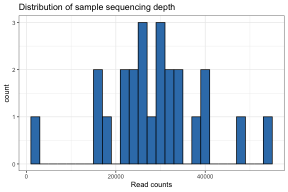
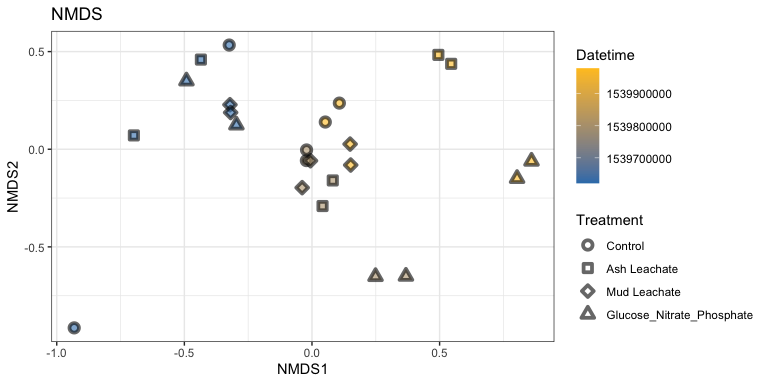
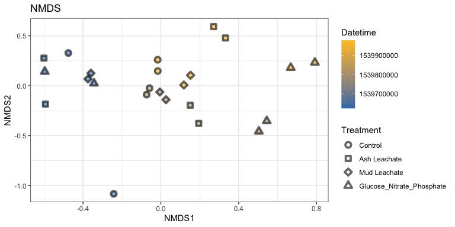
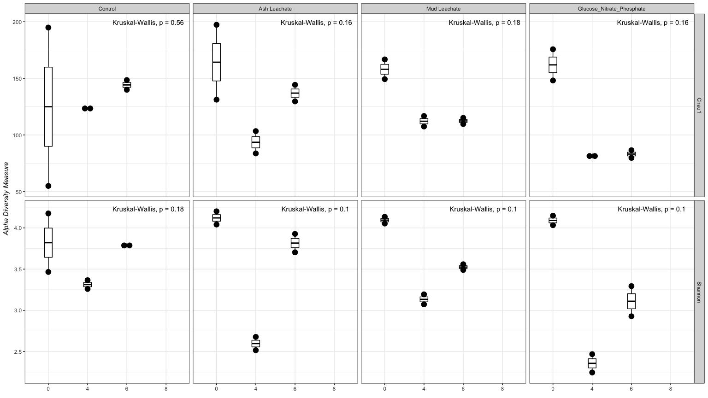
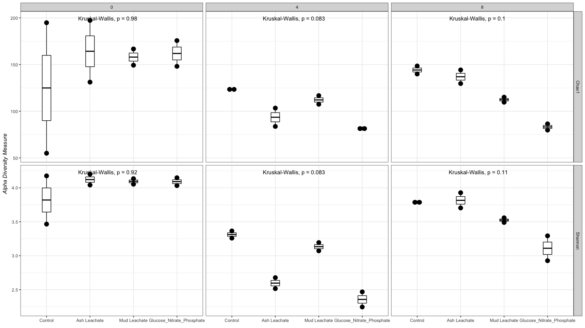
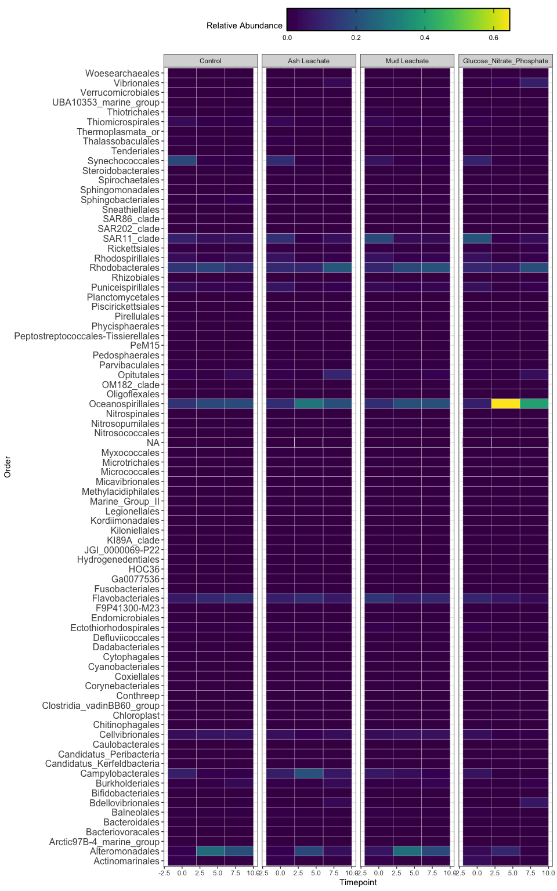
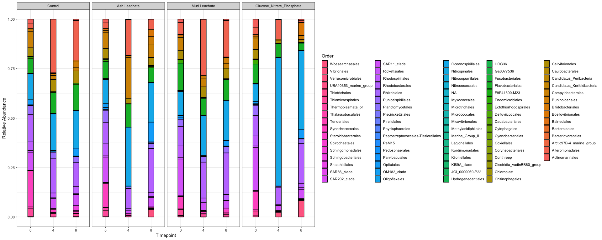

2018\_144L Phyloseq anylysis
================
Christina Jimenez
11/18/2020

# Intro

We explore the processed 2018\_144l sequences using
[phyloseq](https://joey711.github.io/phyloseq/)

# Install phyloseq

``` r
# BiocManager::install("phyloseq")
```

``` r
library(tidyverse) 
library(phyloseq)
library(RColorBrewer)
library(readxl)
```

# Import Data

``` r
count.tab <- read_rds("~/Desktop/GITHUB/144l_students/Output_Data/week5/2018seqtab-nochimtaxa.rds") #table of counts for each sequence in each sample
tax.tab <- read_rds("~/Desktop/GITHUB/144l_students/Output_Data/week5/2018taxa.rds") #table that matches ASV to sequence

metadata <- read_excel("~/Desktop/GITHUB/144l_students/Input_Data/week3/144L_2018_BactAbund.xlsx", sheet = "Metadata")
subset <- metadata %>% 
  select(Treatment, Bottle, Timepoint, DNA_SampleID)
sample <- read_rds("~/Desktop/GITHUB/144l_students/Output_Data/week 4/144L_2018TOC.rds")

sample.tab <- left_join(sample, subset) %>% 
  drop_na(DNA_SampleID) %>%
  column_to_rownames(var = "DNA_SampleID") 
```

# Phyloseq Object

``` r
OTU = otu_table(count.tab, taxa_are_rows = TRUE)
TAX = tax_table(tax.tab)
SAM = sample_data(sample.tab)
ps = phyloseq(OTU,TAX,SAM)
```

# Filter sequences

``` r
sub_ps <- ps %>%
  subset_taxa(Family  != "mitochondria" & Order  != "Chloroplast")
```

# Sample Summary



``` r
# mean, max and min of sample read counts
summary(sample_sum_df)
```

    ##       sum       
    ##  Min.   : 2064  
    ##  1st Qu.:23420  
    ##  Median :28834  
    ##  Mean   :28810  
    ##  3rd Qu.:33570  
    ##  Max.   :53948

# Beta Diversity

## Subsample

``` r
ps_min <-  rarefy_even_depth(sub_ps, sample.size = min(sample_sums(sub_ps)))
```

    ## You set `rngseed` to FALSE. Make sure you've set & recorded
    ##  the random seed of your session for reproducibility.
    ## See `?set.seed`

    ## ...

    ## 135OTUs were removed because they are no longer 
    ## present in any sample after random subsampling

    ## ...

``` r
mean(sample_sums(sub_ps)) #28809
```

    ## [1] 28809.88

``` r
mean(sample_sums(ps_min)) #2064  
```

    ## [1] 2064

## NMDS

``` r
set.seed(1)
# Ordinate
nmds <- ordinate(sub_ps, method = "NMDS",  distance = "bray") # stress = 0.07
```

    ## Square root transformation
    ## Wisconsin double standardization
    ## Run 0 stress 0.074576 
    ## Run 1 stress 0.07751882 
    ## Run 2 stress 0.1568709 
    ## Run 3 stress 0.07457602 
    ## ... Procrustes: rmse 2.486471e-05  max resid 4.347194e-05 
    ## ... Similar to previous best
    ## Run 4 stress 0.08275644 
    ## Run 5 stress 0.07582401 
    ## Run 6 stress 0.07706745 
    ## Run 7 stress 0.162472 
    ## Run 8 stress 0.0775189 
    ## Run 9 stress 0.1637053 
    ## Run 10 stress 0.07582401 
    ## Run 11 stress 0.1188993 
    ## Run 12 stress 0.07457586 
    ## ... New best solution
    ## ... Procrustes: rmse 0.0001113699  max resid 0.0004340464 
    ## ... Similar to previous best
    ## Run 13 stress 0.1682004 
    ## Run 14 stress 0.0843871 
    ## Run 15 stress 0.07751883 
    ## Run 16 stress 0.2400351 
    ## Run 17 stress 0.08275643 
    ## Run 18 stress 0.07457586 
    ## ... Procrustes: rmse 6.874421e-06  max resid 1.5177e-05 
    ## ... Similar to previous best
    ## Run 19 stress 0.08273627 
    ## Run 20 stress 0.07616294 
    ## *** Solution reached

``` r
set.seed(1)
# Ordinate
nmds_min <- ordinate(ps_min, method = "NMDS",  distance = "bray") # stress = 0.08
```

    ## Square root transformation
    ## Wisconsin double standardization
    ## Run 0 stress 0.08366379 
    ## Run 1 stress 0.1472577 
    ## Run 2 stress 0.08459483 
    ## Run 3 stress 0.08366378 
    ## ... New best solution
    ## ... Procrustes: rmse 2.849483e-05  max resid 9.793128e-05 
    ## ... Similar to previous best
    ## Run 4 stress 0.08466778 
    ## Run 5 stress 0.1619285 
    ## Run 6 stress 0.08493122 
    ## Run 7 stress 0.1726576 
    ## Run 8 stress 0.08466778 
    ## Run 9 stress 0.1715182 
    ## Run 10 stress 0.1663045 
    ## Run 11 stress 0.1332959 
    ## Run 12 stress 0.08366378 
    ## ... New best solution
    ## ... Procrustes: rmse 5.491953e-06  max resid 1.670892e-05 
    ## ... Similar to previous best
    ## Run 13 stress 0.08493121 
    ## Run 14 stress 0.09345726 
    ## Run 15 stress 0.08466778 
    ## Run 16 stress 0.1333115 
    ## Run 17 stress 0.1787354 
    ## Run 18 stress 0.08493121 
    ## Run 19 stress 0.09345725 
    ## Run 20 stress 0.1350919 
    ## *** Solution reached





# Alpha Diversity

``` r
richness <- estimate_richness(ps_min, measures = c("Chao1", "Shannon")) %>% 
  rownames_to_column(., var = "DNA_ID") %>% 
  mutate_at(vars(DNA_ID), str_replace_all, pattern = "X144", "144")
```

Let’s add the sample metadata into this dataframe

``` r
alphadiv <- left_join(richness, sample.tab %>% rownames_to_column(., var = "DNA_ID")) 
```

    ## Joining, by = "DNA_ID"





# Generate relative abundances

``` r
ps_std <- transform_sample_counts(ps_min, function(x) x/sum(x))
#extract the relative abundance table and coerce into dataframe
ps_std.tab <- as(otu_table(ps_std), "matrix")
ps_std.df = as.data.frame(ps_std.tab) 
```

# Make table

``` r
#Taxa table into a data frame
tax.df <-  as.data.frame(tax.tab) 

#Combine data frames
custom.tab <- tax.df %>% 
  rownames_to_column(., var = "asv") %>% 
  left_join(., ps_std.df %>% rownames_to_column(., var = "asv")) %>% 
  #New index of that combines the  class, order, family, and genus values
  mutate(pco = paste(Phylum, "_", Class, "_", Order)) %>% 
  select(-c(asv:Genus)) %>% 
  select(pco,everything()) %>% 
  group_by(pco) %>% 
  summarise_at(vars(contains(c("144"))), sum, na.rm = T) %>% 
  ungroup()
```

    ## Joining, by = "asv"

``` r
#Row names into column names
colnames <- custom.tab[,1] 
#transpose the dataframe

t_custom.tab <-  as.data.frame(t(custom.tab[,-1]))
colnames(t_custom.tab) <- colnames$pco

#merge
sweet.tab <- t_custom.tab %>% 
  rownames_to_column(., var = "sample") %>% 
  left_join(., sample.tab %>% rownames_to_column(., var = "sample") %>% select(sample, Experiment, Bottle, Treatment, Timepoint, days, cells)) %>% 
  select(sample, Experiment:cells, everything())
```

    ## Joining, by = "sample"

``` r
relabund <- sweet.tab %>% 
  select(-c(sample:cells)) %>% 
  .[, order(colSums(-.))] %>% 
  bind_cols(sweet.tab %>% select(sample:cells), .)
```

## Heatmap



# Save and knit

``` r
saveRDS(sweet.tab, "~/Desktop/GITHUB/144l_students/Output_Data/week6/Custom_ASV_Table.rds")
saveRDS(sub_ps, "~/Desktop/GITHUB/144l_students/Output_Data/week6/phyloseq_obj.rds")
saveRDS(ps_min, "~/Desktop/GITHUB/144l_students/Output_Data/week6/subsampled_phyloseq_obj.rds")
saveRDS(alphadiv, "~/Desktop/GITHUB/144l_students/Output_Data/week6/alphadiv.rds")
```

# Stacked Barplots



``` r
saveRDS(relabar.data, "~/Desktop/GITHUB/144l_students/Output_Data/week6/relabar_data.rds")
```
